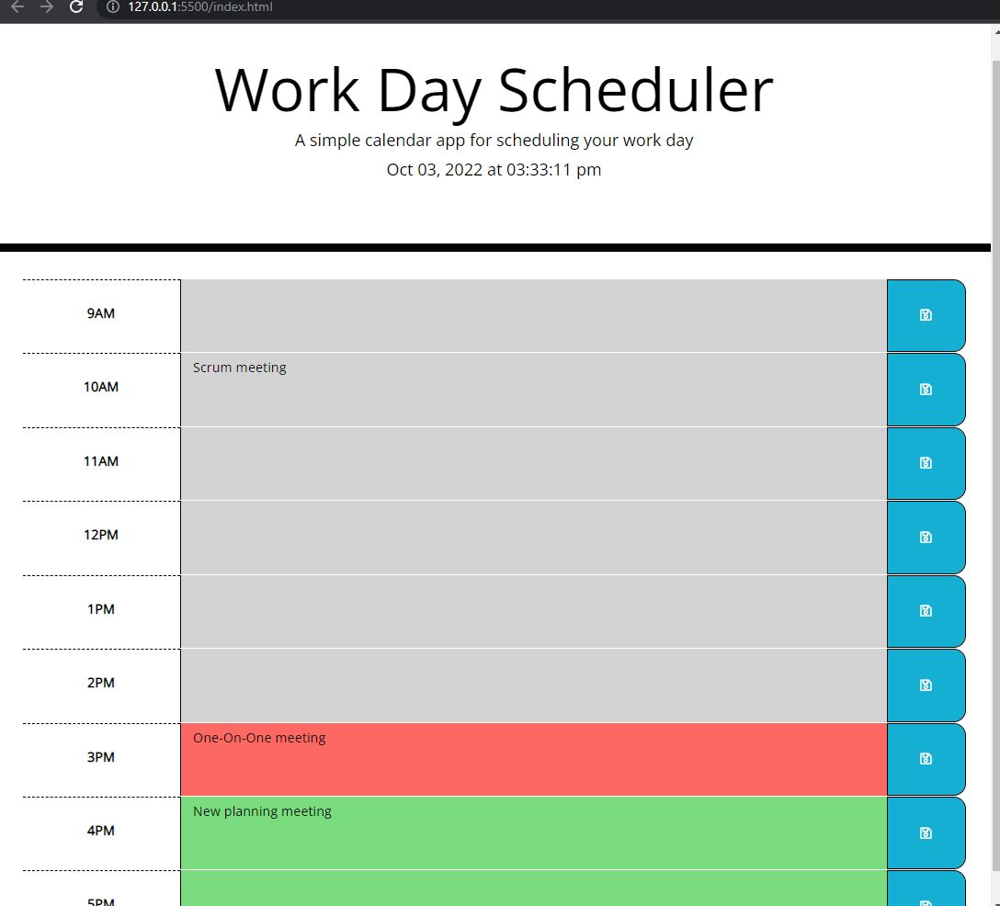

# Work Day Scheduler Application

## Project Overview

Work Day Scheduler 1.0 build. Developer created single-window application to display schedule for current work day with editable time blocks for scheduling tasks.
This application is a daily planner that can help with users' time management. Written with JavaScript to store events by the hour, specific criteria for the work day scheduler also include displaying the current day at the top of the calendar, specific time blocks for standard business hours color-coded to indicate whether a time block is in the past, present or future. Text is saved in local storage upon clicking the save button and persists when refreshing the page. In the future, we may look into making this function as a weekly planner.

## Usage

1. Open the Work Day Scheduler URL in your browser.
2. Add event descriptions in the timeblocks and save by clicking the save button.

## Technologies Used:

* jQuery
* JavaScript
* HTML
* CSS

## Live Application

https://serhiyzv.github.io/work-day-scheduler/

## Screenshot

